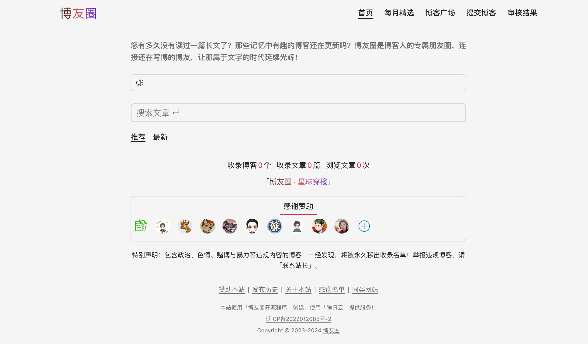
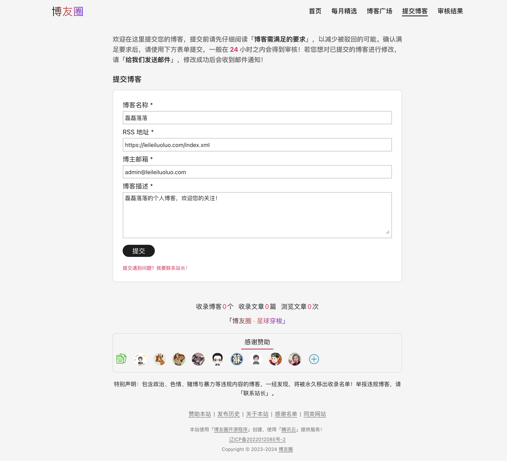
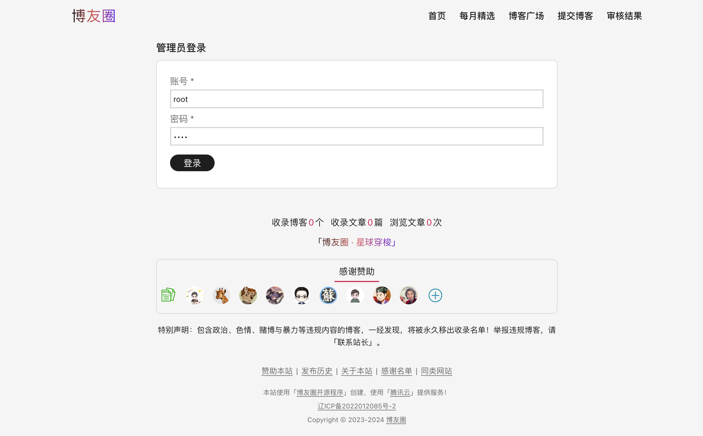
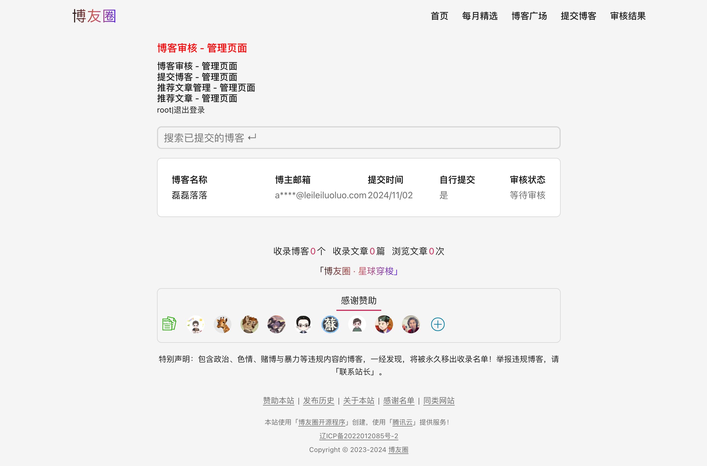
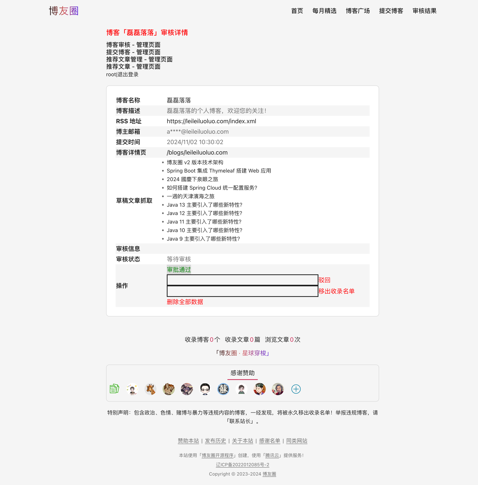

# 博友圈前端源码

博友圈（v2）是一个前后端分离的 Web 项目，该工程（[boyouquan-ui](https://github.com/leileiluoluo/boyouquan-ui)）为前端部分。后端部分请参阅 [boyouquan-api](https://github.com/leileiluoluo/boyouquan-api)。

## 工程架构

该工程使用 React 编写，依赖管理及构建工具为 npm，打包工具为 webpack。项目结构主要分两层，一个是页面层，一个是组件层，此外还有一些常量（Constants）和工具包（Utils）等对此两层提供支持。对后台发请求使用的是原生的 `fetch()` 方法。


## 设置与启动

启动前请确保本地已安装 npm（v10.8 及以上），且确保后端程序（[boyouquan-api](https://github.com/leileiluoluo/boyouquan-api)）已成功启动。

### 依赖包安装

请使用如下命令进行依赖包安装：

```shell
npm install
```

### 程序启动

请使用如下命令运行程序：

```shell
npm start
```

程序启动完成后，浏览器打开 [http://localhost:3000](http://localhost:3000)，即可对其进行访问。

### 功能测试

博友圈有两套页面，一个是公有页面，另一个是私有的管理页面。

上一步程序启动后，我们打开首页，看到的是一个无数据的空白页面。



首先，需要进入博客提交页面（[http://localhost:3000/blog-requests/add](http://localhost:3000/blog-requests/add)），提交一条测试博客。



提交成功后，打开管理员登录页面（[http://localhost:3000/admin/login](http://localhost:3000/admin/login)），输入您在 [执行后端 SQL 脚本时](https://github.com/leileiluoluo/boyouquan-api?tab=readme-ov-file#%E6%95%B0%E6%8D%AE%E5%BA%93%E5%88%9B%E5%BB%BA%E5%8F%8A-ddl-%E6%89%A7%E8%A1%8C) 设置的账号和密码。



登录成功后，在博客审核页面（[http://localhost:3000/admin/blog-requests](http://localhost:3000/admin/blog-requests)）即可以看到您刚刚在公共页面提交的测试博客。



点击博客名称进入博客详情页面，点击「审批通过」。



再次回到公共页面，进入博客广场（[http://localhost:3000/blogs](http://localhost:3000/blogs)），即可以看到您提交的测试博客已公开显示。

## 前后端部署

在部署前端时会使用 webpack 工具将 React 原始项目构建为纯静态文件（JS、HTML 和 CSS），然后放到主机对应的目录下。

后端启动后是一个通用的 Java 程序。

所以，使用 Nginx 将前后端同时进行反向代理即可对外提供服务，其部署架构如下图所示。


nginx 配置如下：

```text
server {
    listen 443 ssl;
    server_name www.boyouquan.com;

    location / {
        root /usr/share/nginx/html/boyouquan-ui;
        try_files $uri /index.html;
    }

    location ~ ^/(api|gravatar|feed\.xml) {
        proxy_pass http://localhost:8080;
    }

    location /websocket {
        proxy_pass http://localhost:8080/websocket;
        proxy_http_version 1.1;
        proxy_set_header Upgrade $http_upgrade;
        proxy_set_header Connection "Upgrade";
    }
}
```

即把以 `/api`、`/gravatar`、`/feed.xml` 和 `/websocket` 开头的请求打到后端服务，其它请求则打到前端。至此，博友圈前后端即可以以同一个域名来对外提供服务了。
